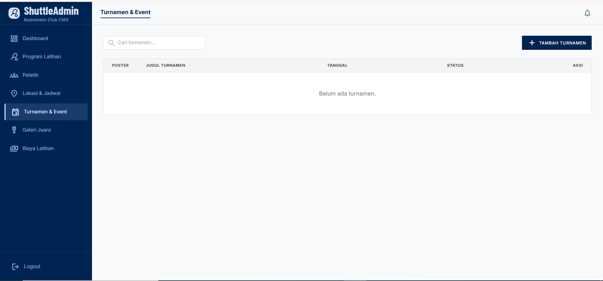

# PB Tangkis Jaya

Website promosi dan sistem manajemen konten untuk klub bulutangkis lokal di Solo. Dibuat untuk membantu klub mempromosikan program latihan, mempermudah pendaftaran calon member, serta memungkinkan pengelola klub mengelola informasi turnamen dan galeri foto secara mandiri lewat admin dashboard.

## Tech Stack

- Next.js 14 (App Router, Server Actions)
- Tailwind CSS
- Supabase (PostgreSQL, Auth, Storage)
- Vercel

## Screenshot





## Cara Menjalankan

1. Clone repository ini
   ```bash
   git clone https://github.com/<username>/PbTangkisJaya.git
   cd PbTangkisJaya/app
   ```
2. Install dependencies
   ```bash
   npm install
   ```
3. Salin file environment dan isi konfigurasi
   ```bash
   cp .env.example .env.local
   ```
   Isi `NEXT_PUBLIC_SUPABASE_URL`, `NEXT_PUBLIC_SUPABASE_ANON_KEY`, dan nomor WhatsApp di `.env.local`.
4. Jalankan file `supabase/migration.sql` di Supabase SQL Editor untuk membuat tabel yang dibutuhkan
5. Buat storage bucket sesuai panduan di [`STORAGE_SETUP.md`](./app/STORAGE_SETUP.md)
6. Buat admin user secara manual di Supabase Auth Dashboard
7. Jalankan development server
   ```bash
   npm run dev
   ```
   Aplikasi bisa diakses di `http://localhost:3000`

## Demo Live

[Coba aplikasi di sini](https://app-beta-pied-78.vercel.app)

## Portofolio Lengkap

Lihat detail lengkap project ini di [Edusoft Portfolio](https://portfolio.edusoftcenter.com/contributors/aziz-achmad-juniar)
